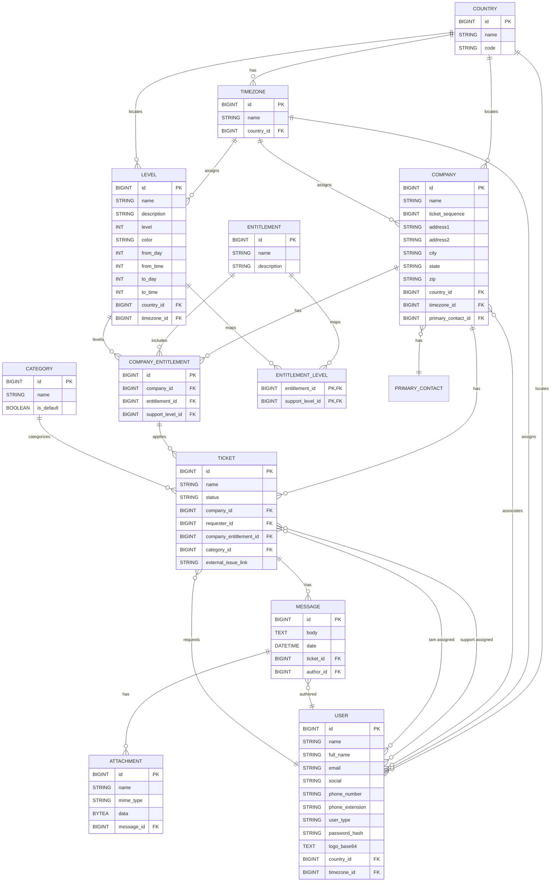

<!--
  Eclipse Public License - v 2.0

    THE ACCOMPANYING PROGRAM IS PROVIDED UNDER THE TERMS OF THIS ECLIPSE
    PUBLIC LICENSE ("AGREEMENT"). ANY USE, REPRODUCTION OR DISTRIBUTION
    OF THE PROGRAM CONSTITUTES RECIPIENT'S ACCEPTANCE OF THIS AGREEMENT.
-->

# Entity Diagram

