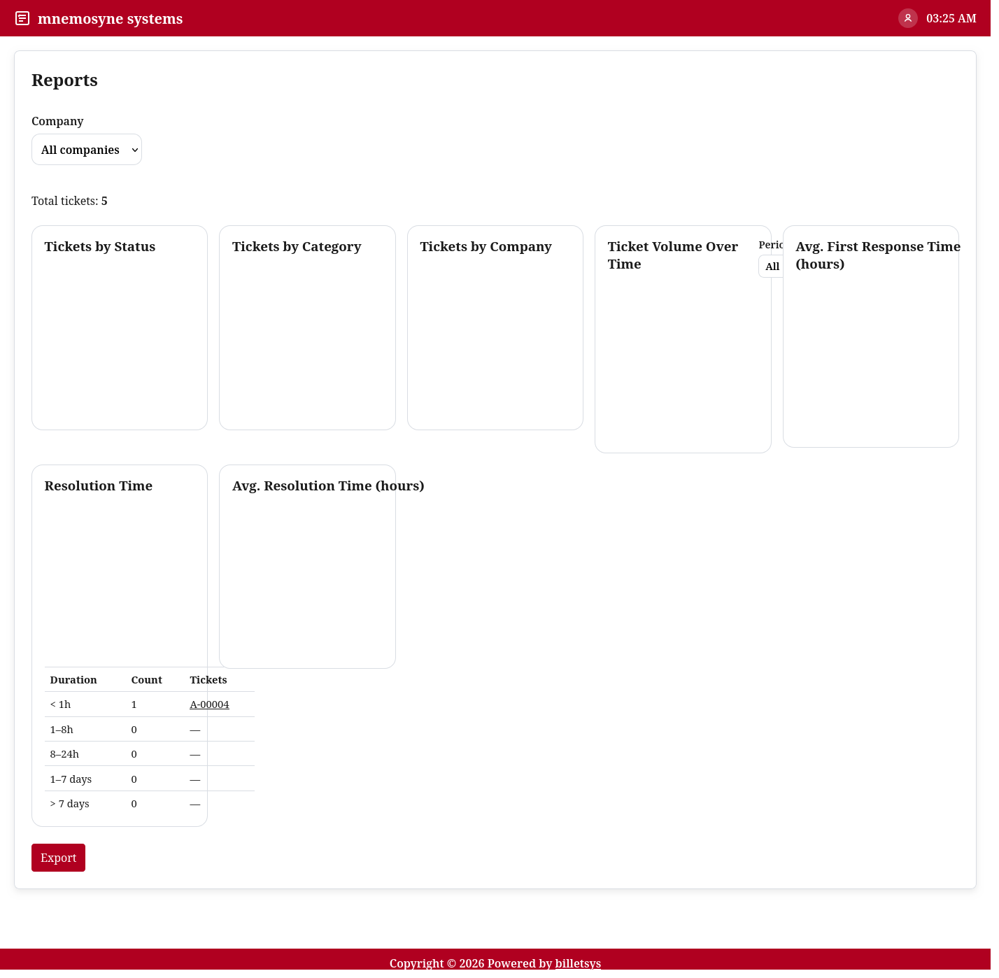

\newpage

# Reports

The **Reports** area provides analytical views of ticket activity so that teams can understand workload, trends, and service behavior over time.

{ width=100% }

## Purpose

Ticket lists are useful for day-to-day operations, but reports answer different questions:

* How many tickets are being created
* How work is distributed by status or category
* How activity changes over time
* How quickly tickets are being answered or resolved

This makes the reporting area valuable for oversight, planning, and follow-up.

## Main views

The reporting functionality is organized around visual summaries of ticket data. Depending on role and scope, reports can show information such as:

* Tickets by status
* Tickets by category
* Tickets by company
* Ticket volume over time
* First-response time (minimum, average, maximum)
* Average resolution time
* Pickup time (minimum, average, maximum)
* Resolution distribution

These views help turn ticket data into operational insight.

## Company and scope

Reports are role-aware. The visible report scope depends on who is using the system.

This means the reporting area can support:

* Global oversight for administrators
* Company-scoped insight for superusers
* Assigned-account insight for TAM users

The result is that each reporting user sees a perspective that matches their responsibility.

## Period filtering

Reports are also useful because they can be viewed across different time ranges. This supports both high-level trend analysis and shorter-term operational follow-up.

Examples include looking at all available history, a recent year, or a current month.

## Visual analysis

The report pages are centered on charts and summaries rather than raw records. This helps users quickly identify patterns, compare categories, and understand whether service performance is improving or deteriorating.

In practical use, reports can help answer questions such as:

* Which categories generate the most work
* Whether ticket volume is rising or falling
* Which companies generate the most cases
* Whether response, pickup, and resolution times are acceptable

## Pickup time

The pickup time report shows how quickly tickets are picked up after they are created. It measures the time from ticket creation (opened) to the first assignment (assigned), grouped by category.

For each category the report shows the minimum, average, and maximum pickup time in hours. This makes it possible to see both the typical pickup speed and outliers within the same view.

Tickets that have been created but not yet assigned are still counted. For those tickets the current time is used as the end point, so long-waiting unassigned tickets increase the reported values instead of being excluded.

Like the other reports, pickup time is available to roles with oversight responsibilities (admin, TAM, and superuser), each seeing the scope that matches their responsibility.

## First response time

The first response time report shows how quickly tickets receive their first answer from the support team. It measures the time from the requester's first message to the first reply by support, grouped by category.

For each category the report shows the minimum, average, and maximum first response time in hours. This makes it possible to see both the typical response speed and outliers within the same view.

Tickets that have not received a support reply yet are excluded entirely. Only tickets with an actual first response contribute to the reported values.

Like the other reports, first response time is available to roles with oversight responsibilities (admin, TAM, and superuser), each seeing the scope that matches their responsibility.

## Export

Billetsys also supports exporting reports so they can be shared outside the live application. This is useful when teams need a portable summary for review meetings, customer communication, or internal follow-up.

## Role perspective

Reports are not part of every role's daily workflow. They are mainly intended for roles with coordination, oversight, or management responsibilities.

This helps keep the user-facing experience simple while still providing richer analytical tools where they are needed.

## Why it matters

The reports area helps billetsys move beyond case handling alone. It gives teams a way to understand what is happening across the support process and to use that insight for planning, improvement, and accountability.
