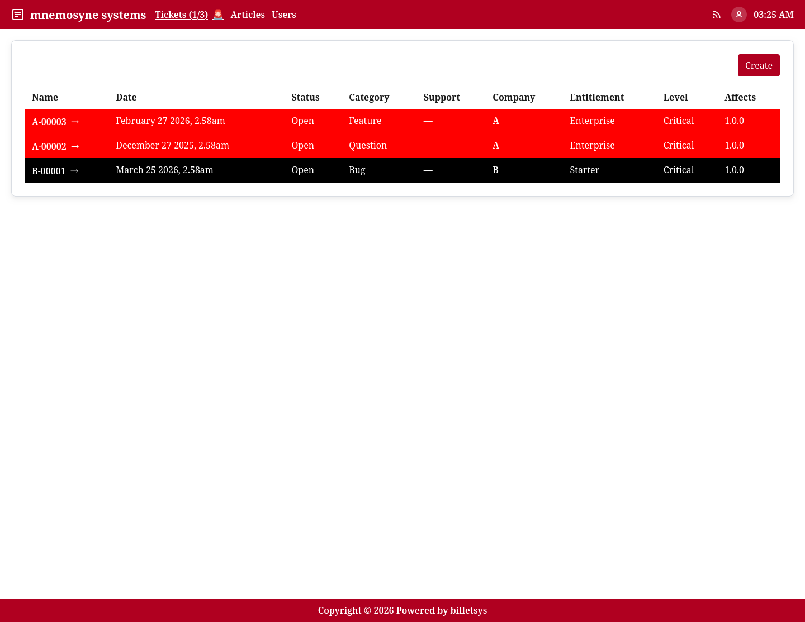

\newpage

# Tickets

The **Ticket** is the central object in billetsys. It represents a support case from the first report through investigation, communication, and final resolution.

{ width=100% }

## Purpose

Tickets bring together the information needed to manage a case in one place. Instead of splitting status, ownership, communication, and attachments across different tools, billetsys keeps them connected to the same record.

## Core information

A ticket can hold the main context for a support issue, including:

* Ticket identifier
* Ticket title
* Company
* Requester
* Status
* Category
* Entitlement
* Affected and resolved versions
* Support and TAM assignments
* External issue reference
* Ticket rating and feedback
* Message history

This allows teams to understand both the current state of a case and how it reached that state.

The entity model stores the ticket identifier and the ticket title separately. The identifier is the generated case reference used for routing, exports, and cross-system references, while the title is the human-written summary entered when the ticket is created.

## Lifecycle

Tickets move through a lifecycle that begins when an issue is reported and ends when the case is resolved and closed.

A typical flow looks like this:

* A ticket is created
* The ticket is reviewed and assigned
* Support and customer communication continues in the message thread
* Status changes reflect current progress
* The ticket reaches "Resolved" state
* The user provides an optional 10-star rating and feedback comment
* A resolved case is eventually closed, either manually or automatically after a configured inactivity period (default is 7 days)

This lifecycle gives both customer-facing roles and operational roles a shared view of progress.

## Status and ownership

Status is one of the most important parts of the ticket workflow. It helps users understand whether a case is waiting for action, already assigned, actively being worked on, or completed.

Ownership matters just as much. Support assignments and TAM involvement make it clear who is currently responsible for handling the case and who is following the customer relationship.

## Ticket lists

Billetsys provides ticket lists that help each role focus on the cases relevant to them. Depending on role, the interface can emphasize:

* Personal tickets
* Company-scoped tickets
* Assigned work
* Open work
* Closed work

This makes the ticket area useful both for individual follow-up and for operational queue management.

### Pagination and page size

Ticket lists are paginated. The default page size is **10**, but it can be changed per-page using the rows-per-page selector at the bottom of any list. Available options are 10, 25, and 50.

Users can set a personal default in their **Profile** under *Default rows*. This preference applies to all paginated lists across the application. The per-page selector overrides this default for the current view.

The current page, page size, sort column, and direction are preserved in the browser URL. This means paginated views are **bookmarkable** — sharing or reopening a URL returns to the exact same view state.

### Column sorting

Ticket list columns can be sorted by clicking the column header. Clicking a column that is already the active sort toggles between ascending (▲) and descending (▼) order. Clicking a different column starts ascending sort on that column.

Sortable columns include: **Name**, **Title**, **Date**, **Status**, **Category**, **Company**, **Entitlement**, **Level**, and **Affects**.

### Keyboard shortcuts

For roles that use the ticket queues, these keyboard shortcuts are available from the application header:

* `Ctrl+A` opens **Active tickets**
* `Ctrl+O` opens **Open tickets**
* `Ctrl+C` opens **Closed tickets**
* `Ctrl++` opens **Create ticket**

When a ticket queue view is open, `Alt+1` through `Alt+9` open the first through ninth ticket in the currently visible list order, and `Alt+0` opens the tenth ticket. 

On the ticket detail page, the following shortcuts are available to jump directly to specific fields or sections (and will automatically open dropdown menus):

* `Alt+1`: Jump to Summary / Title
* `Alt+2`: Jump to Category
* `Alt+3`: Jump to Status
* `Alt+4`: Jump to External Issue link
* `Alt+5`: Jump to Affects Version
* `Alt+6`: Jump to Resolved Version
* `Alt+7`: Jump to the Messages Thread
* `Alt+8`: Focus the Reply Editor

These shortcuts work universally, even if you are viewing read-only versions of the fields. If you are actively typing inside a text box (like the Reply Editor) and wish to use a shortcut to jump elsewhere, simply use the `Alt+Number` shortcut directly—they will gracefully navigate you out of the current field.

## Ticket search

Ticket lists also include a search control in the main application header (`Ctrl+K`). The search is opened from the search icon shown before the RSS feed icon.

The header search control does not display a keyboard shortcut label. The documented ticket shortcuts are the queue shortcuts listed above.

Once the search field is open, users can type a search term and press `Enter` to filter the current ticket queue.

When the entered text matches ticket identifiers or ticket titles, the search also offers autocomplete suggestions. For example, typing `A-` can suggest a ticket such as `A-00001`.

The search currently matches:

* Ticket identifier
* Visible ticket message content

This makes it possible to find a case either by its ticket number or by text that appeared in the conversation history.

For private messages, search only matches message content that is visible to the current user role.

Search is queue-aware. For example, when a user searches from the open tickets view, the result only includes matches from that open ticket list. The same behavior applies to assigned and closed ticket queues.

## Detail view

The ticket detail page is where the full case comes together. It combines the current ticket data with the full conversation history, attached files, assignments, and related references.

This page is the main working area for understanding a case in context.

Cross-references from other tickets that mention this ticket are shown in a dedicated Related section in the ticket header.

## Ratings and feedback

Once a ticket has been marked as **Resolved**, a rating can be submitted to capture customer satisfaction. A rating consists of a 1–10 star scale and an optional text comment. A ticket can only be rated once.

### Who can submit a rating

* **Users** can rate their own tickets — only tickets where they are the requester.
* **Superusers** can rate tickets belonging to their company. A superuser can only see and interact with tickets scoped to the company they belong to.

Support, TAM, and Admin roles cannot submit ratings.

### Who can view a rating

Once a rating has been submitted, it becomes a read-only display on the ticket detail page. Visibility follows the same company-scoping rules as the ticket itself:

* **Users** see the rating on their own tickets.
* **Superusers** see ratings on all tickets within their company.
* **TAMs** see ratings on tickets for the companies they are assigned to.
* **Support** agents see ratings on all tickets they have access to.
* **Admins** see ratings through the ticket workbench, which provides a system-wide view across all companies.

### Auto-close

If a resolved ticket is not rated within a configurable period (default: 7 days), the system automatically closes it. The interval can be configured by an Admin through the **Owner** settings page under "Ticket auto-close." Setting the value to **0** disables auto-close entirely.

When a ticket is auto-closed, its rating is set to **-1**. This sentinel value distinguishes auto-closed tickets from those that have not yet been rated (`null`) and those with an actual user-submitted rating (`1`–`10`).

## External tracking

Tickets can also include an external issue reference. This makes it easier to connect billetsys with development or defect tracking workflows outside the ticket system itself.

## Export

Billetsys supports exporting tickets so that a case can be shared, archived, or reviewed outside the live application. This is useful when teams need a portable version of the case record.

## Role perspective

All roles interact with tickets, but not in the same way.

In general:

* Users follow the cases they reported
* Superusers coordinate tickets within their broader company scope
* TAMs monitor and follow ticket activity across assigned accounts
* Support staff actively work and update tickets
* Admins oversee the structures behind the ticket process

This shared but role-aware design is what makes the ticket model the center of billetsys.
