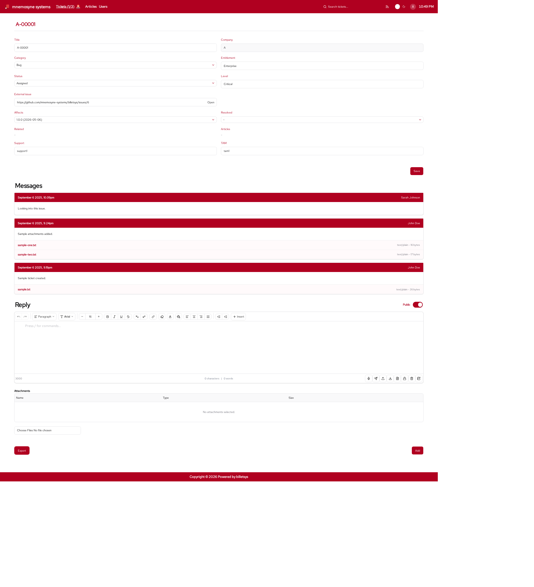

\newpage

# Email

The **Email** functionality in billetsys connects ticket activity with outgoing notifications, direct incoming email, and mailbox-based ticket updates.

{ width=100% }

## Purpose

Support work often continues outside the web interface. Email integration helps billetsys stay aligned with how support teams and customers already communicate, while still keeping the ticket system as the main source of record.

## Outgoing notifications

Billetsys can send outgoing notifications when important ticket activity happens.

Typical examples include:

* New messages on a ticket
* Status changes
* Updates that affect the people following the case

This helps requesters, support users, and other involved roles stay informed without needing to constantly refresh the application.

Typical recipients include:

* The requester
* Assigned TAM users
* Assigned support users

## Incoming email

Billetsys also supports workflows where incoming email becomes part of the ticket conversation. This makes it possible to continue support communication through email while still preserving the ticket history in the application.

There are two main incoming paths:

* `POST /mail/incoming` for direct integration from another system
* Scheduled mailbox polling for IMAP or POP3 mailboxes

Both paths reuse the same ticket-ingestion logic.

The `POST /mail/incoming` endpoint is enabled by default. Installations that want to turn it off can set `ticket.mail.incoming.enabled=false`. When disabled, the endpoint is no longer available, while outgoing email and mailbox polling can still be used separately.

## How billetsys matches email to tickets

When a message arrives, billetsys uses the sender and subject to decide whether it should create a new ticket or update an existing one.

Typical rules are:

* The `From:` address must match a known user
* The sender's company defines which company context the ticket belongs to
* A subject token such as `[A-00005]` is used to find an existing ticket
* If no ticket token is present, billetsys creates a new ticket for the sender's company
* If the sender does not belong to the ticket context, the email is ignored

This means customers can continue a discussion by replying with the ticket number in the subject, while brand new requests can still become new tickets automatically.

## Mailbox polling

Mailbox polling lets billetsys pull messages directly from a mailbox on a schedule.

This is useful when:

* Customers send email to a shared support mailbox
* Another mail gateway forwards messages into a mailbox
* The organization wants billetsys to import unread email automatically

After a message is processed successfully, billetsys marks it as seen. Installations can also be configured to delete processed messages from the mailbox.

## Ticket-linked communication

Email works best when it stays connected to the ticket record. In billetsys, email-related activity supports that goal by helping message updates and case changes remain visible in the same support flow as web-based actions.

This reduces the risk that support communication becomes fragmented across separate tools.

## Shared awareness

When email notifications are sent, the right participants can stay aligned on the current state of a case. This is particularly useful when several roles are involved, such as requesters, support staff, TAMs, and coordinating customer contacts.

## Attachments in mail flow

Because support work often includes file sharing, email-related workflows also benefit from the attachment model used elsewhere in billetsys. This helps preserve not only the written update, but also the supporting files that came with it.

Attachments received through incoming email or mailbox polling are stored on the ticket message so the files remain visible inside the case history.

## Operational flow

A common mailbox-driven workflow looks like this:

* A user sends an email from an address already known in billetsys
* Billetsys reads the sender and subject
* If the subject contains a token such as `[A-00005]`, the message is added to that ticket
* If there is no token, billetsys creates a new ticket for the sender's company
* Any attachments are stored with the new ticket message
* Outgoing notifications keep the involved users informed

This gives teams a practical bridge between email habits and structured ticket handling.

## Operational value

Email integration makes billetsys more practical in real support environments. It supports the way people already communicate while still bringing that communication back into the managed ticket workflow.

## Why it matters

Without email support, the application would only reflect part of the conversation. With email integration, billetsys can act as a more complete communication hub for support cases, not just a place where ticket fields are updated.
