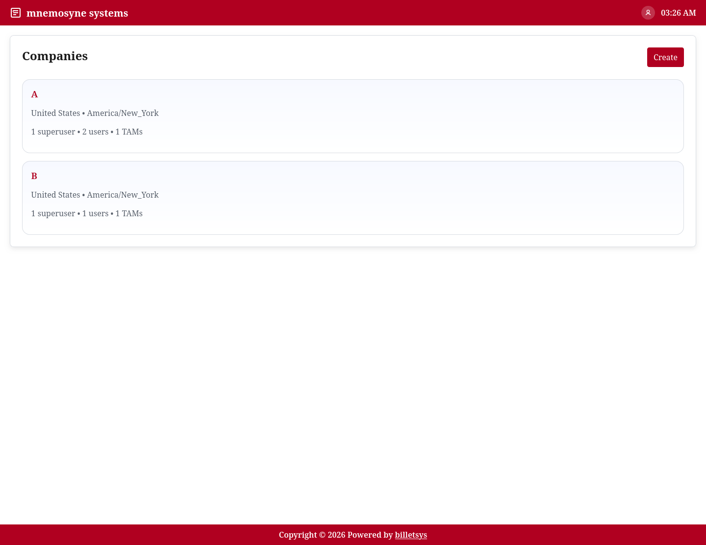

\newpage

# Companies

The **Companies** feature organizes the customer and organizational structure that tickets belong to.

{ width=100% }

## Purpose

Tickets, users, entitlements, and account responsibilities need a shared organizational context. In billetsys, that context is the company record.

By grouping work around companies, the system can reflect how support is usually delivered in real environments: not just to individual people, but to customer organizations.

## What a company represents

A company record can describe the core identity and context of an organization, including:

* Company name
* Address information
* Country and timezone
* Superusers and related users
* Related users
* Related TAMs
* Support entitlements
* Ticket history

This gives billetsys a stable structure for organizing customer activity.

## Company scope

Company membership matters across the application. It helps define which users belong to an organization, which tickets are associated with it, and which roles can coordinate work around that account.

This is important because many workflows in billetsys are company-aware rather than purely user-specific.

## Contacts and coordination

Each company can have superusers and a wider set of associated users. This helps support teams understand who represents the organization and who participates in ticket activity.

It also helps customer-side coordination roles work from a shared account view rather than isolated ticket records.

## Entitlements and service context

Companies are also where service relationships are expressed. Entitlements and related service information connect to the company record so that ticket handling can reflect the support context of the customer.

This makes the company feature more than an address book entry. It is part of how billetsys represents the service relationship itself.

## Operational value

From an operational perspective, companies make it easier to answer questions such as:

* Which organization owns a ticket
* Which users are associated with that organization
* What support context applies
* How activity is distributed across customers

That makes the company record one of the key administrative foundations of the system.

## Keyboard shortcuts

Like all paginated list views in the application, the companies list supports keyboard shortcuts for quick navigation. You can use `Alt+1` through `Alt+0` to open items in the currently visible list.

On the company form page, the following shortcuts are available to jump directly to specific fields (and open dropdowns automatically):
* `Alt+1`: Jump to Name
* `Alt+2`: Jump to Phone number
* `Alt+3`: Jump to Address 1
* `Alt+4`: Jump to City
* `Alt+5`: Jump to Country
* `Alt+6`: Jump to Time zone

These shortcuts work universally. See the **Navigation** chapter for more details.

## Role perspective

Companies are most important for the roles that coordinate or administer broader sets of work, such as admins, superusers, TAMs, and support staff.

For end users, the company context is still important, but it is usually experienced indirectly through the tickets and workflows they see.
