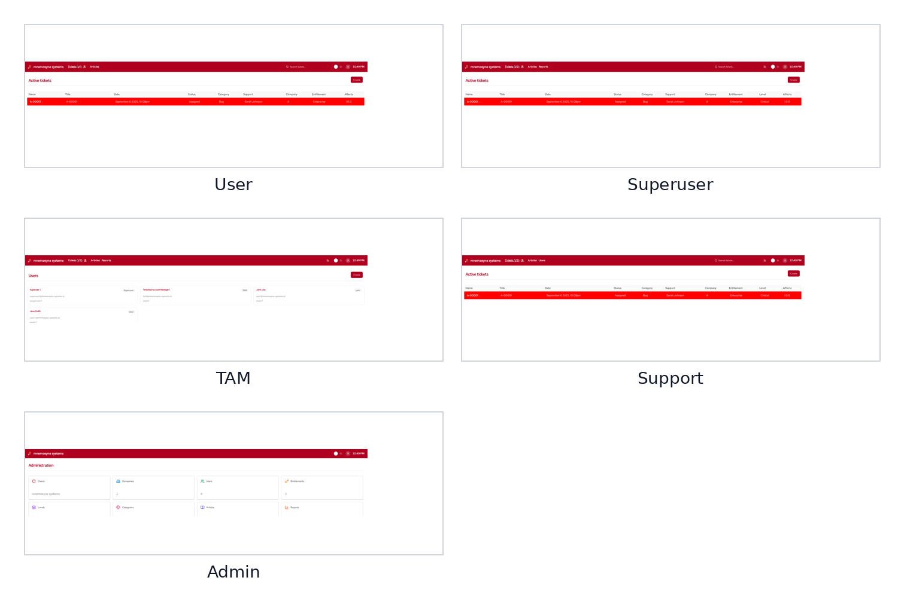

\newpage

# Navigation

The **Navigation** structure in billetsys helps users move through the application according to their role and scope of responsibility.

{ width=100% }

## Purpose

Billetsys includes several roles with different kinds of access. Navigation is what turns that role model into a practical user experience.

Instead of giving every user the same menu structure, the application guides each role toward the areas that matter most for that kind of work.

## Role-based structure

Navigation is role-aware throughout the application. This means that a user, support agent, superuser, TAM, or admin can all enter the system through different starting points and see different navigation paths.

This helps keep the interface focused and reduces noise for each audience.

## Working areas

The navigation model connects users to the main working areas of billetsys, such as:

* Tickets
* Users
* Companies
* Articles
* Reports
* Profile and account pages
* Administrative configuration

The set of visible areas depends on the current role.

## Layout consistency

Navigation also works together with the shared layout system. Different parts of billetsys may use different role-oriented layouts, but the goal stays the same: keep movement through the application predictable and aligned with the user's responsibilities.

This gives the manual a useful way to explain why the same application can feel different depending on who is signed in.

## Operational value

Good navigation matters because it shortens the path between login and useful work. In a support environment, this means people can move more quickly from overview to action.

For example, navigation helps users:

* Find relevant ticket lists
* Move from a list to a detail page
* Reach profile and account maintenance
* Switch between operational and administrative areas

## Keyboard shortcuts and pagination

Keyboard shortcuts such as `Alt+1` through `Alt+0` always refer to items **on the current page** or **the current view**. On paginated lists, moving to a different page updates the shortcut targets to match the visible items.

This means that `Alt+1` on page 2 opens the first item on page 2 — not the first item across the entire dataset. This behavior keeps shortcuts predictable regardless of how many items exist. On detail pages, these same shortcuts are context-aware and jump focus between major sections and form fields.

These shortcuts work universally across the application, even if you are currently typing inside a text box or have a dropdown menu open. Using a shortcut will gracefully navigate you out of your current input and directly into the new target field or open the targeted dropdown. If you wish to manually unfocus any active input or dropdown without navigating away, you can press `Escape`.

## Why it matters

Without structured navigation, a role-based support platform quickly becomes confusing. With it, billetsys turns role boundaries and system structure into a clearer day-to-day workflow for every kind of user.
